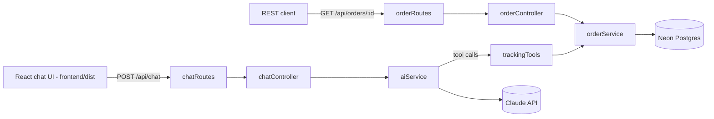

# E-Commerce AI Assistant

Automated order & tracking support assistant. An Express API that lets customers ask natural-language questions about their orders, backed by Claude tool-calling and a Neon (serverless Postgres) database.


## Features

- Natural-language chat endpoint that looks up real order data via Claude tool calling, scoped to the authenticated customer
- REST endpoints for listing a customer's orders and fetching one by number
- React UI (`frontend/`, Vite) with client-side routing: an order list, per-order detail pages, and the chat view, gated behind order-ownership verification
- Postgres-backed via Neon; schema auto-applies on startup

## Tech Stack

| Layer    | Choice                               |
|----------|---------------------------------------|
| Runtime  | Node.js + Express                     |
| Database | Neon (serverless Postgres) via `pg`   |
| AI       | Claude (Anthropic SDK, tool calling), model `claude-haiku-4-5` |
| Frontend | React 18 + Vite (`frontend/`)         |

## Architecture



## API

| Method | Path              | Description                                                      |
|--------|-------------------|--------------------------------------------------------------------|
| GET    | `/health`         | Liveness check for load balancers / container orchestrators (no auth) |
| POST   | `/api/auth/verify` | Prove ownership of an order (order number + email) and receive a customer-scoped token (no auth) |
| POST   | `/api/chat`       | Send a conversation; assistant replies using order-lookup tools scoped to the authenticated customer (requires `Authorization: Bearer <token>`) |
| GET    | `/api/orders`     | List every order belonging to the authenticated customer (requires `Authorization: Bearer <token>`) |
| GET    | `/api/orders/:id` | Fetch a single order by order number - only if it belongs to the authenticated customer (requires `Authorization: Bearer <token>`) |

## Setup

```bash
npm install
npm run build       # builds frontend/dist (installs frontend deps first)
cp .env.example .env
# fill in ANTHROPIC_API_KEY, DATABASE_URL (from your Neon project), and JWT_SECRET in .env
npm start
```

For frontend-only iteration, `npm --prefix frontend run dev` runs Vite's dev server on its own port and proxies `/api/*` to a locally running `npm start` on port 3000.

`ANTHROPIC_API_KEY` comes from an Anthropic Console account (console.anthropic.com) - separate from any claude.ai chat subscription, billed per token.

The `orders` table and seed rows are created automatically on startup via `database.sql`. Server runs at `http://localhost:3000`.

### Auth

Per-customer, not a shared key. A customer proves who they are with something only they'd know: their order number *and* the email it was placed under - the same low-friction pattern real package-tracking tools use (Shopify, UPS, FedEx). No password to store, no email-sending service required.

```bash
# 1. Verify ownership, get a token scoped to that customer's email
curl -X POST http://localhost:3000/api/auth/verify \
  -H "Content-Type: application/json" \
  -d '{"orderNumber": "ORD-1001", "email": "jane.doe@example.com"}'
# => {"token": "eyJhbGciOi..."}

# 2. Use it on subsequent requests
curl -H "Authorization: Bearer eyJhbGciOi..." http://localhost:3000/api/orders/ORD-1001
```

The token is a JWT (`JWT_SECRET`, 1 hour expiry) carrying the customer's email. Every protected route uses it, never a value the client supplies:

- `GET /api/orders/:id` - `orderController` returns `404` (not `403`, to avoid confirming another customer's order exists) if the order's `customer_email` doesn't match the token.
- `POST /api/chat` - the authenticated email is passed into `aiService.runChat()` and threaded through to every tool implementation in `trackingTools.js`. Each one enforces the ownership check server-side (`get_my_orders` ignores any email the model might be told to pass and always uses the authenticated one), so the assistant can't be prompted into revealing a different customer's order - the model never has the ability to ask for someone else's data in the first place.

`RATE_LIMIT_AUTH_MAX` (default 10 per `RATE_LIMIT_AUTH_WINDOW_MS`, default 60s) limits `/api/auth/verify` specifically, since it's a credential-guessing surface.

### Authorization

Authentication proves *who's asking*; authorization is the separate guarantee that being authenticated only ever grants access to *your own* data, never anyone else's. Every data-returning path enforces this the same way: the customer's email comes from the verified JWT (`req.customerEmail`, set by `requireCustomerAuth`) and is never accepted from a request body, query string, or model output.

| Surface | Enforcement |
|---|---|
| `GET /api/orders` | SQL is scoped with `WHERE customer_email = $1` using `req.customerEmail` - there's no parameter through which another customer's data could be requested |
| `GET /api/orders/:id` | `orderController.getOrder` compares the fetched order's `customer_email` to `req.customerEmail`; mismatch or missing order both return an identical `404 Order not found`, so the response never confirms whether an order number exists at all |
| `POST /api/chat` tools (`trackingTools.js`) | `get_order_by_number` and `get_order_by_tracking_number` fetch the order first, then discard it (return `null`) unless it belongs to `context.customerEmail`; `get_my_orders` takes no email parameter at all - the model has no way to even ask for someone else's data |
| `POST /api/auth/verify` | Wrong order number and wrong email on a real order return the identical generic `401`, so the endpoint can't be used to enumerate which order numbers exist |

Live-verified against the real Neon database (not just mocked): authenticating as `jane.doe@example.com` and requesting `john.smith@example.com`'s order by number, by tracking number, and via the chat tool implementations directly all correctly return `404`/`null` rather than the other customer's data. Test coverage lives in `test/app.test.js` (HTTP-level, cross-customer tokens via `issueToken()`) and `test/trackingTools.test.js` (tool-level, asserting a different `customerEmail` in context yields `null` even when the order lookup itself succeeds).

### Rate limiting

- `/api/auth/verify` is capped at `RATE_LIMIT_AUTH_MAX` requests (default 10) per `RATE_LIMIT_AUTH_WINDOW_MS` (default 60s) per client, to slow down (order number, email) guessing.
- `/api/chat` is capped at `RATE_LIMIT_MAX` requests (default 20) per `RATE_LIMIT_WINDOW_MS` (default 60s) per client, to bound Claude API cost under abuse or accidental retry loops.
- `/api/orders/:id` is capped at `RATE_LIMIT_ORDERS_MAX` requests (default 30) per `RATE_LIMIT_ORDERS_WINDOW_MS` (default 60s) per client, to slow down order-number enumeration/scanning attempts.

Each is an independent limiter (separate quota). Exceeding any of them returns `429`.

### Structured logging

Logging runs on [pino](https://getpino.io) (`src/config/logger.js`), emitting structured JSON lines (level, timestamp, message, fields) instead of plain strings - readable by Render's log viewer or any log aggregator. `pino-http` logs every request/response (method, url, status, response time, a generated request id), including ones that never reach a route (404s, auth rejections, rate limits). Level is configurable via `LOG_LEVEL` (default `info`).

`src/utils/logger.js`'s `logError(label, err)` wraps this for caught errors, and the configured `err` serializer only ever includes `type`/`message`/`stack` - never the raw error object. Some HTTP client libraries attach debug properties (request config, headers) directly to thrown errors, and pino's *default* error serializer would include those; ours doesn't, closing a real path for an API key or Authorization header to end up in logs. Client-facing error responses are always a fixed generic message regardless of the underlying failure.

### Frontend routing

`react-router-dom` (`BrowserRouter`), not just conditionally-rendered state. Four real routes, each with a distinct URL, browser back/forward, and direct-link support:

| Route | Page | Access |
|---|---|---|
| `/verify` | `VerifyPage` | Public only - redirects to `/orders` if already authenticated |
| `/orders` | `OrdersPage` | Protected - lists the customer's orders (`GET /api/orders`) |
| `/orders/:orderNumber` | `OrderDetailPage` | Protected - single order (`GET /api/orders/:id`); a different customer's order number 404s here the same as it does over the API |
| `/chat` | `ChatPage` | Protected |

`AuthContext` (`frontend/src/context/AuthContext.jsx`) holds the token and is read by `ProtectedRoute`/`PublicOnlyRoute` to decide whether to render the route or `<Navigate>` elsewhere. Since `express.static` alone 404s on a hard refresh of a client-side route like `/orders/ORD-1001` (no such file exists), `src/app.js` has a catch-all `app.get('*', ...)` after every real route that serves `frontend/dist/index.html` and lets React Router take over - verified working for both in-app navigation and direct/hard-loaded URLs.

### State management

- **Global state** (the auth token) lives in one place, `AuthContext`, backed by `sessionStorage`. Nothing else reads or writes that storage key directly.
- **Cross-cutting behavior** (attaching the token to a request, treating a `401` as "log out") lives in one hook, `useAuthorizedFetch` (`frontend/src/hooks/useAuthorizedFetch.js`), used by every page that calls an authenticated endpoint (`OrdersPage`, `OrderDetailPage`, `ChatPage`) instead of each one re-implementing it.
- **Server state** (fetched data) is local to the page that owns it - `useState` + `useEffect`, with a `cancelled` flag in the cleanup function so a fast route change (e.g. clicking into an order, then immediately going back) can't let a stale response overwrite newer state.

No global store beyond `AuthContext` - the app doesn't have enough shared, cross-page data to justify one, and adding one would just be indirection around two pieces of state (a token and whatever the current page fetched).

### HTTPS enforcement

When `NODE_ENV=production`, `src/middleware/httpsEnforce.js` redirects any plain-HTTP request to HTTPS (301) and sets `Strict-Transport-Security` on secure responses. `app.set('trust proxy', 1)` is also enabled in production so Express derives `req.secure` (and the real client IP used by rate limiting) from Render's `X-Forwarded-Proto`/`X-Forwarded-For` headers, since Render terminates TLS at its edge and forwards plain HTTP to the container over one hop. This is inactive outside `NODE_ENV=production`, so local dev and tests are unaffected.

### Secrets management

Three secrets: `ANTHROPIC_API_KEY`, `DATABASE_URL`, `JWT_SECRET`. Handled consistently, but not identically, across every environment:

| Environment | How secrets get in | Never in the repo because |
|---|---|---|
| Local dev | `.env`, loaded by `dotenv` | `.env` is gitignored; `.env.example` documents variable names only, never values |
| CI (GitHub Actions) | Hardcoded placeholder values in `package.json`'s `test` script (`test-key-for-ci`, etc.) | Nothing real is needed - `pool.query` and `anthropic.messages.create` are mocked in every test, so CI never makes a live DB or Claude call |
| Docker | `docker-compose.yml`'s `env_file: .env` | The `Dockerfile` never `COPY`s `.env` or bakes a value into a layer - secrets are injected at container start, not build time |
| Render (production) | Entered directly in the Render dashboard | `render.yaml` marks all three `sync: false`, which tells Render to prompt for them interactively rather than storing them in the Blueprint file |

`src/config/requiredEnv.js` + a check at the top of `server.js` make `DATABASE_URL` and `JWT_SECRET` hard requirements - the process logs a clear "Missing required environment variable(s)" error and exits immediately (`process.exit(1)`) rather than starting in a broken state. `ANTHROPIC_API_KEY` is deliberately excluded from that check: a missing key already degrades gracefully per-request (`POST /api/chat` returns a generic `500` instead of the whole app refusing to start), which is what lets this project run locally without an Anthropic account or spending API credits.

Secrets are also never *logged* - see [Structured logging](#structured-logging) above for the `pino` redact config and custom error serializer that keep them out of both request logs and error output.

## Testing

```bash
npm test                    # backend - node:test (test/)
npm --prefix frontend test  # frontend - Vitest + React Testing Library
```

Backend tests mock `pool.query` and `anthropic.messages.create`, so they don't touch Neon or incur API costs. Frontend tests mock `fetch` and `sessionStorage` is reset between tests, so they don't need a running backend.

Frontend tests are co-located next to what they cover (`Component.test.jsx` beside `Component.jsx`) rather than in a separate top-level folder like the backend's `test/` - the more common convention in the React ecosystem, and it keeps a component and its test moving together on a rename or delete. Coverage is deliberately scoped to logic and behavior with real branching (`AuthContext`'s login/logout/persistence, `useAuthorizedFetch`'s 401-triggers-logout behavior, the route guards' redirect logic, `VerifyForm`'s success/error/network-failure paths, `MessageBubble`'s class/content rendering) rather than every page top-to-bottom - full page flows (login → orders → detail → chat, cross-customer 404s, hard-refresh on a client route) are already covered by live headless-browser checks during development, which is a better fit for that kind of end-to-end assertion than a jsdom unit test would be.

## Docker

```bash
docker compose up --build
```

The `Dockerfile` is a multi-stage build: stage one installs `frontend/`'s dependencies and runs `vite build`, stage two installs the backend's production dependencies and copies in the built `frontend/dist`. Runs the resulting image against your `.env` (`docker-compose.yml`). The container exposes a `/health` check.

## Deploy

`render.yaml` defines a free Render web service that builds the existing `Dockerfile` and health-checks `/health`.

1. Push to GitHub (already done if you're reading this from the repo)
2. On [render.com](https://render.com), **New +** → **Blueprint** → connect this repo → Render detects `render.yaml`
3. Fill in the three prompted secrets (`ANTHROPIC_API_KEY`, `DATABASE_URL`, `JWT_SECRET`) - they're marked `sync: false` so Render asks for them rather than storing them in the repo
4. Deploy - Render assigns a public `https://<name>.onrender.com` URL

The free tier spins down after 15 minutes idle, so the first request after inactivity has a cold-start delay (same tradeoff as Neon's compute auto-suspend).

## CI

GitHub Actions (`.github/workflows/ci.yml`) runs on every push to `main`/`staging` and every PR into `main`, across three parallel jobs:

- **test** - builds `frontend/`, runs both test suites (backend `node:test`, frontend Vitest)
- **docker** - builds the production Docker image
- **audit** - `npm audit` against both `package-lock.json`s (root and `frontend/`)

### Dependency vulnerability scanning

The `audit` job always prints the full `npm audit` report for both projects, but only fails the build on a `critical`-severity finding (`--audit-level=critical`). Moderate/high findings routinely depend on *how* a package is actually used, not just which version is installed, and npm audit has no way to express "reviewed, not applicable to us" - a hard fail on every high-severity advisory trains people to ignore CI red, which defeats the point. Two known findings are currently accepted for that reason:

| Package | Severity | Why it's accepted |
|---|---|---|
| `esbuild` (via `vite`) | Moderate | [GHSA-67mh-4wv8-2f99](https://github.com/advisories/GHSA-67mh-4wv8-2f99) only affects Vite's dev server accepting requests from any origin. The dev server never runs in production - Express serves the static `frontend/dist` build - so this is unreachable in the deployed app. |
| `react-router` | High | [GHSA-qwww-vcr4-c8h2](https://github.com/advisories/GHSA-qwww-vcr4-c8h2) only affects apps using React Router's unstable RSC (React Server Components) APIs. This app is a plain client-side SPA (`BrowserRouter`/`Routes`/`Route` - no RSC, no framework mode, verified by grepping `frontend/src` for any RSC import), so it isn't exposed. No patched version exists on npm yet at time of writing (registry tops out at `7.18.1`; the advisory's fix, `8.3.0`, isn't published). |

Both are re-evaluated whenever dependencies are bumped, since "not applicable given current usage" can stop being true the moment the code that uses a library changes.

## Project Structure

```
src/
├── config/       # DB connection (pg Pool), Claude client, pino logger, required-env-var check
├── services/     # business logic - order/auth queries, AI chat/tool-calling loop
├── tools/        # LLM tool/function definitions, scoped to the authenticated customer
├── controllers/  # request/response handling
├── routes/       # Express route definitions
├── middleware/   # customerAuth (JWT), rate limiters, HTTPS enforcement
└── app.js        # Express app assembly - serves frontend/dist
server.js         # process entry point - inits DB schema, then listens
frontend/          # React app (Vite) - separate package.json, own build
├── index.html               # Vite entry HTML
├── vite.config.js
└── src/
    ├── main.jsx               # mounts <App />
    ├── App.jsx                 # BrowserRouter + route definitions
    ├── index.css               # design tokens + component styles
    ├── setupTests.js           # Vitest setup - loads jest-dom matchers
    ├── context/
    │   ├── AuthContext.jsx      # token state (sessionStorage-backed), login/logout
    │   └── AuthContext.test.jsx
    ├── hooks/
    │   ├── useAuthorizedFetch.js # attaches the token to a request, logs out on 401
    │   └── useAuthorizedFetch.test.jsx
    ├── pages/
    │   ├── VerifyPage.jsx      # order number + email verification
    │   ├── OrdersPage.jsx      # GET /api/orders list
    │   ├── OrderDetailPage.jsx # GET /api/orders/:id, reads useParams
    │   └── ChatPage.jsx        # the chat widget
    └── components/
        ├── ProtectedRoute.jsx    # redirects to /verify when logged out
        ├── ProtectedRoute.test.jsx
        ├── PublicOnlyRoute.jsx   # redirects to /orders when already logged in
        ├── PublicOnlyRoute.test.jsx
        ├── Layout.jsx            # nav bar (Orders / Chat / Log out) + <Outlet/>
        ├── VerifyForm.jsx        # the verification form itself
        ├── VerifyForm.test.jsx
        ├── MessageBubble.jsx     # reusable bubble component (user/assistant/pending/error)
        └── MessageBubble.test.jsx
frontend/dist/     # build output (gitignored) - what Express actually serves
test/             # node:test suite (mocked DB/Claude, no live calls)
Dockerfile, docker-compose.yml, .dockerignore   # containerization; Dockerfile builds frontend/ in a separate stage
render.yaml       # Render Blueprint for deployment
.env.example      # documents required environment variables
.github/workflows/ci.yml                        # frontend build + test + Docker build on push/PR
```
