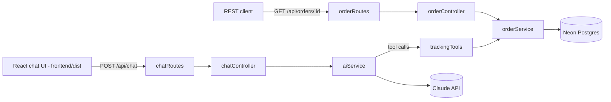

# E-Commerce AI Assistant

Automated order & tracking support assistant. An Express API that lets customers ask natural-language questions about their orders, backed by Claude tool-calling and a Neon (serverless Postgres) database.


## Features

- Natural-language chat endpoint that looks up real order data via Claude tool calling, scoped to the authenticated customer
- REST endpoints for listing a customer's orders and fetching one by number
- React UI (`frontend/`, Vite) with client-side routing: an order list, per-order detail pages, and the chat view, gated behind order-ownership verification
- Postgres-backed via Neon; versioned migrations (`node-pg-migrate`) auto-apply on startup

## Tech Stack

| Layer    | Choice                               |
|----------|---------------------------------------|
| Runtime  | Node.js + Express                     |
| Database | Neon (serverless Postgres) via `pg`   |
| AI       | Claude (Anthropic SDK, tool calling), model `claude-haiku-4-5` |
| Frontend | React 18 + Vite (`frontend/`)         |

## Architecture



## API

| Method | Path              | Description                                                      |
|--------|-------------------|--------------------------------------------------------------------|
| GET    | `/health`         | Liveness check for load balancers / container orchestrators - process is up, nothing more (no auth) |
| GET    | `/health/db`      | Deeper check for external uptime monitoring - liveness plus a real `SELECT 1` against the database, `503` if unreachable (no auth) |
| POST   | `/api/auth/verify` | Prove ownership of an order (order number + email) and receive a customer-scoped token (no auth) |
| POST   | `/api/chat`       | Send a conversation; assistant replies using order-lookup tools scoped to the authenticated customer (requires `Authorization: Bearer <token>`) |
| GET    | `/api/orders`     | Paginated list of orders belonging to the authenticated customer - keyset pagination via `?limit=` (default 20, max 100) and `?cursor=` (opaque, from the previous page's `nextCursor`); responds `{ orders, nextCursor }` (requires `Authorization: Bearer <token>`) |
| GET    | `/api/orders/:id` | Fetch a single order by order number - only if it belongs to the authenticated customer (requires `Authorization: Bearer <token>`) |

## Setup

```bash
npm install
npm run build       # builds frontend/dist (installs frontend deps first)
doppler setup       # links this directory to your Doppler project/config (one-time)
doppler run -- npm start
```

No Doppler account? `cp .env.example .env`, fill in `ANTHROPIC_API_KEY`, `DATABASE_URL` (from your Neon project), and `JWT_SECRET`, then plain `npm start` still works - see [Secrets management](#secrets-management).

For frontend-only iteration, `npm --prefix frontend run dev` runs Vite's dev server on its own port and proxies `/api/*` to a locally running `npm start` on port 3000.

`ANTHROPIC_API_KEY` comes from an Anthropic Console account (console.anthropic.com) - separate from any claude.ai chat subscription, billed per token.

The `orders` table and seed rows are created automatically on startup by running any pending database migrations - see [Database migrations](#database-migrations). Server runs at `http://localhost:3000`.

### Database migrations

Versioned, not just the idempotent `database.sql` this used to be - [`node-pg-migrate`](https://github.com/salsita/node-pg-migrate), plain SQL migration files in `migrations/`. `server.js` runs any pending migrations before `app.listen()`, same as before, just through a real migration runner instead of re-applying one big SQL file on every boot.

```bash
npm run migrate:create -- add-a-column   # scaffolds migrations/<timestamp>_add-a-column.sql
npm run migrate:up                        # apply manually (server.js already does this at startup)
npm run migrate:down                      # roll back the most recent migration
```

Each migration file has an `-- Up Migration` and `-- Down Migration` section. `node-pg-migrate` tracks what's already run in a `pgmigrations` table it manages itself, wraps a run in a single transaction (a failure partway through rolls back cleanly instead of leaving the schema half-migrated), and takes a Postgres advisory lock so two instances starting at once can't race each other.

`migrations/1784973065584_initial-schema.sql` (the only migration so far) uses `CREATE TABLE IF NOT EXISTS` / `ON CONFLICT DO NOTHING` - not because that's the general pattern, but specifically because it had to be safe to adopt onto the live Neon database, which already had this exact schema and seed data from the old `database.sql`-on-every-boot approach. Verified live: ran it against production data with the table/rows already present (idempotent skip via `IF NOT EXISTS`, all 5 seed rows still intact afterward) and again against an already-migrated database (correctly logged "No migrations to run!" and did nothing). Every migration *after* this one should be plain `CREATE`/`ALTER` - once `pgmigrations` has recorded a migration as run, it never runs again, so there's no need to hedge against re-execution.

### Auth

Per-customer, not a shared key. A customer proves who they are with something only they'd know: their order number *and* the email it was placed under - the same low-friction pattern real package-tracking tools use (Shopify, UPS, FedEx). No password to store, no email-sending service required.

```bash
# 1. Verify ownership, get a token scoped to that customer's email
curl -X POST http://localhost:3000/api/auth/verify \
  -H "Content-Type: application/json" \
  -d '{"orderNumber": "ORD-1001", "email": "jane.doe@example.com"}'
# => {"token": "eyJhbGciOi..."}

# 2. Use it on subsequent requests
curl -H "Authorization: Bearer eyJhbGciOi..." http://localhost:3000/api/orders/ORD-1001
```

The token is a JWT (`JWT_SECRET`, 1 hour expiry) carrying the customer's email. Every protected route uses it, never a value the client supplies:

- `GET /api/orders/:id` - `orderController` returns `404` (not `403`, to avoid confirming another customer's order exists) if the order's `customer_email` doesn't match the token.
- `POST /api/chat` - the authenticated email is passed into `aiService.runChat()` and threaded through to every tool implementation in `trackingTools.js`. Each one enforces the ownership check server-side (`get_my_orders` ignores any email the model might be told to pass and always uses the authenticated one), so the assistant can't be prompted into revealing a different customer's order - the model never has the ability to ask for someone else's data in the first place.

`RATE_LIMIT_AUTH_MAX` (default 10 per `RATE_LIMIT_AUTH_WINDOW_MS`, default 60s) limits `/api/auth/verify` specifically, since it's a credential-guessing surface.

### Authorization

Authentication proves *who's asking*; authorization is the separate guarantee that being authenticated only ever grants access to *your own* data, never anyone else's. Every data-returning path enforces this the same way: the customer's email comes from the verified JWT (`req.customerEmail`, set by `requireCustomerAuth`) and is never accepted from a request body, query string, or model output.

| Surface | Enforcement |
|---|---|
| `GET /api/orders` | SQL is scoped with `WHERE customer_email = $1` using `req.customerEmail` - there's no parameter through which another customer's data could be requested |
| `GET /api/orders/:id` | `orderController.getOrder` compares the fetched order's `customer_email` to `req.customerEmail`; mismatch or missing order both return an identical `404 Order not found`, so the response never confirms whether an order number exists at all |
| `POST /api/chat` tools (`trackingTools.js`) | `get_order_by_number` and `get_order_by_tracking_number` fetch the order first, then discard it (return `null`) unless it belongs to `context.customerEmail`; `get_my_orders` takes no email parameter at all - the model has no way to even ask for someone else's data |
| `POST /api/auth/verify` | Wrong order number and wrong email on a real order return the identical generic `401`, so the endpoint can't be used to enumerate which order numbers exist |

Live-verified against the real Neon database (not just mocked): authenticating as `jane.doe@example.com` and requesting `john.smith@example.com`'s order by number, by tracking number, and via the chat tool implementations directly all correctly return `404`/`null` rather than the other customer's data. Test coverage lives in `test/app.test.js` (HTTP-level, cross-customer tokens via `issueToken()`) and `test/trackingTools.test.js` (tool-level, asserting a different `customerEmail` in context yields `null` even when the order lookup itself succeeds).

### Rate limiting

- `/api/auth/verify` is capped at `RATE_LIMIT_AUTH_MAX` requests (default 10) per `RATE_LIMIT_AUTH_WINDOW_MS` (default 60s) per client, to slow down (order number, email) guessing.
- `/api/chat` is capped at `RATE_LIMIT_MAX` requests (default 20) per `RATE_LIMIT_WINDOW_MS` (default 60s) per client, to bound Claude API cost under abuse or accidental retry loops.
- `/api/orders/:id` is capped at `RATE_LIMIT_ORDERS_MAX` requests (default 30) per `RATE_LIMIT_ORDERS_WINDOW_MS` (default 60s) per client, to slow down order-number enumeration/scanning attempts.

Each is an independent limiter (separate quota). Exceeding any of them returns `429`.

### Structured logging

Logging runs on [pino](https://getpino.io) (`src/config/logger.js`), emitting structured JSON lines (level, timestamp, message, fields) instead of plain strings - readable by Render's log viewer or any log aggregator. `pino-http` logs every request/response (method, url, status, response time, a generated request id), including ones that never reach a route (404s, auth rejections, rate limits). Level is configurable via `LOG_LEVEL` (default `info`).

`src/utils/logger.js`'s `logError(label, err)` wraps this for caught errors, and the configured `err` serializer only ever includes `type`/`message`/`stack` - never the raw error object. Some HTTP client libraries attach debug properties (request config, headers) directly to thrown errors, and pino's *default* error serializer would include those; ours doesn't, closing a real path for an API key or Authorization header to end up in logs. Client-facing error responses are always a fixed generic message regardless of the underlying failure.

### Audit logging

`pino-http`'s access log records that a request happened; it doesn't record what it *meant*. `src/config/auditLog.js` adds a separate, filterable trail (`audit: true`, via a pino [child logger](https://getpino.io/#/docs/child-loggers)) for the events actually worth reviewing after the fact:

| Event | Where | Fires on |
|---|---|---|
| `auth.verify_failed` | `authController.js` | Wrong order number/email pair at `/api/auth/verify` |
| `auth.verify_succeeded` | `authController.js` | A customer successfully verifies and gets a token |
| `auth.token_rejected` | `customerAuth.js` | Missing/invalid/expired JWT on a protected route (`reason`: `missing`/`invalid`/`expired`) |
| `order.access_denied` | `orderController.js` | `GET /api/orders/:id` denied (`reason`: `not_found`/`not_owned`) |
| `rate_limit.exceeded` | `rateLimiter.js` | Any of the three limiters trips (`limiter`: `chat`/`orders`/`auth`) |

`order.access_denied` is the one worth calling out specifically: the HTTP response is a `404` regardless of whether the order doesn't exist or belongs to someone else - deliberately, so a client can't use it to enumerate real order numbers (see [Authorization](#authorization)). The audit log entry still tells the two apart internally, and for the `not_owned` case, records *which other customer's* order was requested (`actualOwner`) - an authenticated customer's token hitting an order that genuinely belongs to someone else is meaningfully different signal (possible token leakage/reuse, or targeted probing) than one that just doesn't exist, even though neither is visible to the requester. This is the general shape of audit logging: the external response stays minimal, the internal record stays complete.

Verified live against the real database, not just in mocked tests: a failed verify, a successful verify, a cross-customer access attempt, and an invalid token each produce the exact structured entry documented above, including `order.access_denied` correctly capturing both `requestedBy` and `actualOwner`. `test/auditLog.test.js` covers all five events, including asserting `actualOwner` is *absent* from a `not_found` entry (there's no other customer to name) but present for `not_owned`.

### Monitoring & alerting

Structured logs (above) are only useful if someone's actually looking at them - this is the part that pages a human. Two gaps closed here, found by checking what actually happens on a real failure rather than assuming the logging/health-check story so far already covered it:

- **Unhandled errors used to leak straight past every layer of this app's own error handling.** Every route already wraps its own logic in try/catch, but nothing existed for what falls outside that - e.g. `express.json()` calling `next(err)` on a malformed request body. With no error-handling middleware registered, Express's own default handler took over instead: verified live, a request with an unparseable JSON body got back an **HTML page with a full server stack trace, including file paths**, and the failure never touched the structured logs at all. `src/app.js` now registers a final `(err, req, res, next)` handler after every route that logs it (`logError`) and returns the same generic JSON error shape every other endpoint uses; `test/app.test.js` asserts the malformed-body case specifically.
- **Nothing reported errors anywhere a human would see them in real time.** Logs are searchable after the fact; they don't page anyone. [Sentry](https://sentry.io) (`src/config/sentry.js`) now captures exceptions that reach the new Express error handler, plus process-level `uncaughtException`/`unhandledRejection` (`src/config/crashHandlers.js`) - the two failure modes that otherwise leave *zero* application-level record before the process dies. Entirely optional via `SENTRY_DSN`, same "degrades gracefully, nothing else needs to change" pattern as `ANTHROPIC_API_KEY` (see [Secrets management](#secrets-management)): unset, `Sentry.init()` is simply skipped and every `Sentry.*` call used elsewhere becomes a no-op rather than needing an "is monitoring configured" check at each call site. A `beforeSend` hook strips `authorization`/`cookie`/`x-api-key` request headers before an event would ever leave the process - this pipeline is separate from pino's own redact config, so it needed the same protection applied independently. Only 5xx failures get reported (Sentry's Express integration default) - the 401s/404s/429s this app already returns deliberately for expected conditions don't add noise.
- **`/health` alone isn't a trustworthy uptime signal.** It only ever proves the Node process is up, which is exactly right for Render's own `healthCheckPath` (restart-on-failure shouldn't fire just because Neon hiccuped - restarting this process doesn't fix that). `GET /health/db` adds a real `SELECT 1` against the database and returns `503` if it fails - point an external uptime monitor (e.g. [UptimeRobot](https://uptimerobot.com) or [Better Stack](https://betterstack.com), both have a free tier) at this one instead, with its own alert contacts configured, for an actual "is the product working" signal with a human getting paged on it.

Manual setup outside this repo, same category as the Doppler/Render account creation already documented above - a free [Sentry](https://sentry.io) account and project gets you a DSN to add as `SENTRY_DSN` in Doppler (or `.env` locally); a free uptime monitor account pointed at `/health/db` with email/SMS alerting configured covers the other half. Neither is something to fabricate credentials or a monitor config for - both are a few minutes of manual signup once the code side (this section) is in place.

### Frontend routing

`react-router-dom` (`BrowserRouter`), not just conditionally-rendered state. Four real routes, each with a distinct URL, browser back/forward, and direct-link support:

| Route | Page | Access |
|---|---|---|
| `/verify` | `VerifyPage` | Public only - redirects to `/orders` if already authenticated |
| `/orders` | `OrdersPage` | Protected - lists the customer's orders (`GET /api/orders`) |
| `/orders/:orderNumber` | `OrderDetailPage` | Protected - single order (`GET /api/orders/:id`); a different customer's order number 404s here the same as it does over the API |
| `/chat` | `ChatPage` | Protected |

`AuthContext` (`frontend/src/context/AuthContext.jsx`) holds the token and is read by `ProtectedRoute`/`PublicOnlyRoute` to decide whether to render the route or `<Navigate>` elsewhere. Since `express.static` alone 404s on a hard refresh of a client-side route like `/orders/ORD-1001` (no such file exists), `src/app.js` has a catch-all `app.get('*', ...)` after every real route that serves `frontend/dist/index.html` and lets React Router take over - verified working for both in-app navigation and direct/hard-loaded URLs.

### State management

- **Global state** (the auth token) lives in one place, `AuthContext`, backed by `sessionStorage`. Nothing else reads or writes that storage key directly.
- **Cross-cutting behavior** (attaching the token to a request, treating a `401` as "log out") lives in one hook, `useAuthorizedFetch` (`frontend/src/hooks/useAuthorizedFetch.js`), used by every page that calls an authenticated endpoint (`OrdersPage`, `OrderDetailPage`, `ChatPage`) instead of each one re-implementing it.
- **Server state** (fetched data) is local to the page that owns it - `useState` + `useEffect`, with a `cancelled` flag in the cleanup function so a fast route change (e.g. clicking into an order, then immediately going back) can't let a stale response overwrite newer state.

No global store beyond `AuthContext` - the app doesn't have enough shared, cross-page data to justify one, and adding one would just be indirection around two pieces of state (a token and whatever the current page fetched).

### Accessibility

- **Real `<label>`s, not placeholder-only inputs** - every text input (order verification, chat) has a `<label>` associated via `htmlFor`/`id`. Visually hidden (`.sr-only`) to keep the existing compact design, but announced to screen readers - placeholder text alone disappears the moment someone types and isn't a reliable label substitute.
- **Landmarks** - `<main>` wraps the routed page content (in `Layout` for protected pages, directly in `VerifyPage` for the public one), so assistive tech can jump straight to it instead of tabbing through the nav first.
- **Errors are announced** - every error message (`role="alert"`) and loading/status region (`aria-live="polite"`) is wired so a screen reader user finds out a request failed or finished without having to go looking for it.
- **The chat transcript is a live region** - `#chat` has `role="log"` + `aria-live="polite"`, so new assistant replies get announced as they arrive instead of requiring the user to manually re-navigate to the bottom of the conversation after every message.
- **Focus follows route changes** - `useFocusOnMount` (`frontend/src/hooks/useFocusOnMount.js`) moves focus to each page's `<h1>` on mount. A full page navigation resets browser focus automatically; client-side routing doesn't, so without this, nothing tells a keyboard/screen-reader user that a new "page" just loaded.
- **The tab/window title follows route changes too** - `useDocumentTitle` (`frontend/src/hooks/useDocumentTitle.js`) sets `document.title` per page (e.g. "Your Orders · Order Support Assistant", the order number on the detail page). Same underlying gap as focus: a full page load updates the title from each page's own `<title>`; an SPA route change doesn't touch it at all without this, which otherwise leaves every route indistinguishable in the browser tab, history, or a screen reader's page-load announcement (WCAG 2.4.2, Page Titled).
- **Solid-fill contrast is pinned independent of theme** - buttons and the user's own chat bubble pair white text on `--color-solid-bg` (`frontend/src/index.css`), a value deliberately *not* redefined in the dark-mode block. It used to reuse `--color-primary`, which dark mode lightens for a different reason (so it reads at 4.5:1+ as link/accent text against the dark page background) - that lighter blue against white text is only 3.68:1, under the AA text minimum. One variable couldn't serve both roles at once in dark mode; splitting them fixed the failure without changing how links/accents look.
- **Borders clear the 3:1 non-text contrast minimum** - `--color-border` (input fields, cards, the order list) was `#cccccc` on light / `#3a3d42` on dark, both under 3:1 against their background - on a page where the input background matches the surrounding card exactly, that left field boundaries essentially invisible for low-vision users. Now `#8f8f8f` (light, 3.2:1) / `#6b6f76` (dark, 3.6-3.9:1).

Backed by an automated check, not just a one-time manual pass: `e2e/accessibility.spec.js` runs `@axe-core/playwright` (scoped to the `wcag2a`/`wcag2aa`/`wcag21a`/`wcag21aa` rule tags specifically, matching the WCAG 2.1 AA target rather than axe's broader best-practice defaults) against `/verify`, `/orders`, `/orders/:id`, and `/chat` on every push and asserts zero violations - in both light and dark mode (`page.emulateMedia`), which is what actually caught the two contrast bugs above; the light-mode-only version of this suite had been green the whole time. It also covers states the happy-path routes alone don't reach - a failed verification, a 404'd order, a chat message that gets a real (if graceful) error reply - and asserts, per route, that focus actually lands on the heading and the title actually changes, since axe inspects a snapshot of the DOM and has no way to know what a route change was supposed to do.

### Performance

Measured before optimizing, not assumed - the biggest win by far wasn't shrinking the JS, it was that the ~189KB bundle was being sent to every client completely **uncompressed**, even ones explicitly requesting `Accept-Encoding: gzip`:

- **Compression** - `compression` middleware in `src/app.js`. Real measurement, not a config-looks-right claim: 188,945 bytes → 61,501 bytes over the wire for the main bundle, a client asking for it gzip-compressed. Modern browsers (this app's e2e suite included) get Brotli instead, which compresses even better - the middleware picks whichever the client's `Accept-Encoding` offers.
- **Cache headers** - Vite content-hashes built filenames (`index-<hash>.js`) specifically so they're safe to cache forever; the hash itself changes the moment the content does. `express.static`'s `setHeaders` now sets `Cache-Control: public, max-age=31536000, immutable` for everything under `assets/`, versus `no-cache` for `index.html` (which references those hashed filenames by name, so it must always be revalidated - `no-cache` still allows caching, just forces a fast `304` check on every load rather than serving a stale copy). Previously neither had any real caching policy at all.
- **Route-level lazy loading** - `frontend/src/App.jsx` uses `React.lazy()` per page instead of importing all four eagerly, so Vite code-splits each into its own chunk (~0.2-2.5KB each) fetched only when that route is actually visited, wrapped in a single `<Suspense>` boundary.

`e2e/performance.spec.js` verifies all three against real network requests in a real browser rather than trusting the config: asserts the main bundle actually arrives `Content-Encoding: gzip` or `br`, that hashed assets get the immutable cache header while the HTML shell gets `no-cache`, and - the concrete proof lazy loading is real, not just configured - that visiting `/orders` never triggers a request for `ChatPage`'s chunk until `/chat` is actually navigated to.

### HTTPS enforcement

When `NODE_ENV=production`, `src/middleware/httpsEnforce.js` redirects any plain-HTTP request to HTTPS (301). `app.set('trust proxy', 1)` is also enabled in production so Express derives `req.secure` (and the real client IP used by rate limiting) from Render's `X-Forwarded-Proto`/`X-Forwarded-For` headers, since Render terminates TLS at its edge and forwards plain HTTP to the container over one hop. This is inactive outside `NODE_ENV=production`, so local dev and tests are unaffected.

### Security headers

[`helmet`](https://helmetjs.github.io/) (`src/middleware/securityHeaders.js`), applied to every response in every environment. This app is a fully self-contained SPA - no external fonts, CDN scripts, or inline `<style>`/`<script>` in the built output (verified: no `style={{}}` prop anywhere in `frontend/src` either, which CSP governs separately from `<style>` blocks), and nothing that needs to embed it in someone else's page - so a few of helmet's already-fairly-strict defaults are tightened further for this specific app:

| Directive | This app | helmet's default |
|---|---|---|
| `style-src` | `'self'` | `'self' https: 'unsafe-inline'` |
| `font-src` | `'self'` | `'self' https: data:` |
| `frame-ancestors` | `'none'` | `'self'` |

Everything else - `default-src 'self'`, `object-src 'none'`, `X-Content-Type-Options: nosniff`, `Referrer-Policy: no-referrer`, `Cross-Origin-Opener-Policy`, and more - is helmet's default set, verified live via `curl -I` against a running instance rather than assumed. `Strict-Transport-Security` is the one header gated to `NODE_ENV=production` specifically (browsers ignore it entirely when it arrives over plain HTTP per RFC 6797, so there's no reason to emit a permanently-inert header on every local/CI response) - `httpsEnforce.js`'s redirect is the other, also production-only, half of that story; it no longer sets the header itself now that helmet owns it.

Two headers added on top of helmet's own defaults, both found by the [OWASP ZAP baseline scan](#dynamic-scanning-dast) rather than added speculatively - the first real findings that scan turned up:

- **`Cross-Origin-Embedder-Policy: require-corp`** - helmet supports this but leaves it off by default, since `require-corp` breaks any page that loads cross-origin resources without CORP/CORS. This app doesn't (same fact the CSP tightening above already relies on), so it's safe to turn on.
- **`Permissions-Policy: camera=(), microphone=(), geolocation=(), payment=(), usb=(), interest-cohort=()`** - helmet dropped Permissions-Policy support entirely as of v8 (the standardized feature set changes too often for helmet to keep an authoritative default), so this is set directly (`permissionsPolicy` in `securityHeaders.js`) rather than through a helmet option. This app never uses any of these browser features, so they're disabled outright.

One helmet CSP default is *removed* outside production, the same way HSTS already was: `upgrade-insecure-requests` (present in `getDefaultDirectives()`) tells the browser to silently rewrite every subresource fetch to `https:`. Only meaningful once the app is genuinely served over HTTPS - and actively broken otherwise: found while adding [cross-browser e2e coverage](#cross-browser--cross-device-coverage), where it took down *every single* WebKit and Mobile Safari test. Chromium/Firefox special-case loopback addresses (`127.0.0.1`/`localhost`) as exempt from the upgrade; WebKit doesn't, so with no real TLS listener on the local/CI port, every script and stylesheet request failed and the app never rendered at all - a directive doing exactly what it's supposed to do turned into a real bug purely because of *where* it was being applied. `securityHeaders.js` now sets it to `[]` (helmet's default, enabled) only when `NODE_ENV=production`, and `null` (which helmet's `parseDirectives` treats as "omit this directive entirely") otherwise.

`test/securityHeaders.test.js` and `test/httpsProduction.test.js` assert both the tightened CSP directives and the environment-gated ones (HSTS, `upgrade-insecure-requests`) land correctly in each environment, and the full e2e suite - now genuinely cross-browser, not just Chromium - passing is itself evidence the CSP isn't too strict for any of the five browser/device combinations it runs under.

### Secrets management

Three application secrets: `ANTHROPIC_API_KEY`, `DATABASE_URL`, `JWT_SECRET`. They live in [Doppler](https://doppler.com) (free tier), not as raw values scattered across environments - Doppler is the single source of truth, with versioning and an audit log of who changed what, when.

| Environment | How secrets get in |
|---|---|
| Local dev | `doppler run -- npm start` fetches secrets and injects them into the process env at startup - nothing touches disk. `.env` still works as a documented, Doppler-free fallback for quick local iteration (see `.env.example`). |
| CI (GitHub Actions) | Untouched by Doppler - hardcoded placeholder values in `package.json`'s `test` script (`test-key-for-ci`, etc.), since `pool.query` and `anthropic.messages.create` are mocked in every test and CI never makes a live DB or Claude call. |
| Docker (local `docker compose up`) | The image's own `CMD` is `doppler run -- node server.js` - export a Doppler service token as `DOPPLER_TOKEN` in the shell running `docker compose up` and `environment: [DOPPLER_TOKEN]` in `docker-compose.yml` passes it through. |
| Render (production) | Same `CMD` as above runs inside the deployed container. `render.yaml` now holds exactly one `sync: false` secret, `DOPPLER_TOKEN` (a service token scoped to the production config) - Render never sees `ANTHROPIC_API_KEY`, `DATABASE_URL`, or `JWT_SECRET` directly; Doppler hands them to the process at startup instead. |

This is a real trade-off, made deliberately rather than defaulted into: this app has three secrets, one small service, and no rotation/audit requirement yet, so a dedicated secrets manager is arguably more infrastructure than the current scale strictly needs. Doppler's free tier and the fact that `doppler run` requires zero application code changes (it injects into `process.env` exactly like `dotenv` did) made adopting one now cheap enough to be worth the upgrade path - centralized rotation and an audit trail exist before they're needed, not after an incident forces the issue.

`src/config/requiredEnv.js` + a check at the top of `server.js` still make `DATABASE_URL` and `JWT_SECRET` hard requirements regardless of *how* they arrived - the process logs a clear "Missing required environment variable(s)" error and exits immediately (`process.exit(1)`) rather than starting in a broken state (e.g. `DOPPLER_TOKEN` itself missing or invalid, so `doppler run` never populates anything). `ANTHROPIC_API_KEY` is deliberately excluded from that check: a missing key already degrades gracefully per-request (`POST /api/chat` returns a generic `500` instead of the whole app refusing to start), which is what lets this project run locally without an Anthropic account or spending API credits.

Secrets are also never *logged* - see [Structured logging](#structured-logging) above for the `pino` redact config and custom error serializer that keep them out of both request logs and error output.

## Testing

```bash
npm test                    # backend - node:test (test/)
npm --prefix frontend test  # frontend - Vitest + React Testing Library
npm run build && npm run test:e2e  # e2e - Playwright, full stack, real browsers, real devices
npm run loadtest             # load test - real concurrency against a running server (see below)
```

Backend tests mock `pool.query` and `anthropic.messages.create`, so they don't touch Neon or incur API costs. Frontend tests mock `fetch` and `sessionStorage` is reset between tests, so they don't need a running backend.

Frontend tests are co-located next to what they cover (`Component.test.jsx` beside `Component.jsx`) rather than in a separate top-level folder like the backend's `test/` - the more common convention in the React ecosystem, and it keeps a component and its test moving together on a rename or delete. Coverage is deliberately scoped to logic and behavior with real branching (`AuthContext`'s login/logout/persistence, `useAuthorizedFetch`'s 401-triggers-logout behavior, the route guards' redirect logic, `VerifyForm`'s success/error/network-failure paths, `MessageBubble`'s class/content rendering) rather than every page top-to-bottom - full page flows are what the e2e suite is for.

### E2E tests

`e2e/` (Playwright), against real browsers and a real running server - no mocks. `playwright.config.js`'s `webServer` builds nothing itself but starts `node server.js` (on a dedicated port, `NODE_ENV=test` so the HTTPS-redirect middleware stays off) and waits for `/health` before running:

- **`auth.spec.js`** - unauthenticated visits redirect to `/verify`; verifying with a real order number + its email logs in; the wrong email for a real order shows an error and doesn't log in; logging out blocks protected routes again
- **`orders.spec.js`** - the order list shows only the logged-in customer's own orders; clicking into one shows the right fields; the browser back button returns via real history, not just component state; a hard-refresh on `/orders/:id` still works (proves the SPA-fallback catch-all in `src/app.js`); navigating directly to a *different* customer's order number by URL shows a not-found error rather than their data
- **`chat.spec.js`** - the chat page is reachable, and sending a message without a configured AI provider surfaces a visible error bubble rather than hanging - this project intentionally doesn't pay to test real Claude replies end-to-end (see [Secrets management](#secrets-management)), so the graceful-failure path is what's asserted on instead
- **`accessibility.spec.js`** - runs `@axe-core/playwright` against every key page and asserts zero violations - see [Accessibility](#accessibility)
- **`performance.spec.js`** - compression, cache headers, and lazy-loaded route chunks, verified against real network requests - see [Performance](#performance)

Needs a real Postgres to run against - locally that's whatever `DATABASE_URL` is already set to (a `.env` or Doppler works exactly like it does for `npm start`, since `server.js` is what `webServer` runs); in CI it's an ephemeral `postgres:16` service container, schema'd and seeded fresh on every run by the same migrations the app already applies on startup - see [Database migrations](#database-migrations). `src/config/db.js` only forces SSL when the target isn't `localhost`, since Neon requires it but a plain CI Postgres container doesn't support it at all.

### Cross-browser / cross-device coverage

Every spec above runs under five `projects` in `playwright.config.js`, not just one fixed Chromium window: Chromium, Firefox, and WebKit at desktop size, plus two touch/mobile-viewport presets (Pixel 5, iPhone 13). Nothing in `e2e/` is Chromium-specific, so this is the same 20-ish tests re-run five ways rather than a separate mobile-only suite to maintain - one spec file, one source of truth for what "correct" means, checked against five real rendering engines/viewports instead of trusting that Chromium behavior generalizes.

The two mobile presets are the ones that actually matter here, not just box-checking: both fall under the `max-width: 480px` breakpoint in `frontend/src/index.css` (edge-to-edge layout, no card chrome, a shorter chat transcript height) that Desktop Chrome at its default viewport never triggers - without a device project running the same specs at that width, that entire CSS path had no automated coverage at all, mobile-specific bugs there would only ever surface manually.

CI installs all three engines (`npx playwright install --with-deps`, no longer just `chromium`) - the tradeoff is roughly 5x the `e2e` job's runtime for what's genuinely new coverage (a real rendering/JS engine difference, or the mobile breakpoint), not test count for its own sake.

Standing up this project's WebKit/Mobile Safari coverage found two real, unrelated bugs on its first run, in order: `baseURL`/`webServer.url` pointed at `localhost`, which Playwright's Linux WebKit resolves to the IPv6 loopback the server doesn't listen on (fixed - use `127.0.0.1`); then, once that connection issue was gone, every WebKit/Mobile Safari test *still* failed - the CSP's `upgrade-insecure-requests` directive, which Chromium/Firefox silently exempt loopback addresses from but WebKit doesn't (see [Security headers](#security-headers) for the full story and fix). Neither would have surfaced on Chromium alone.

### Load testing

Every other test in this project mocks `pool.query` or, in the e2e suite, exercises a handful of sequential requests against a real database - neither says anything about what happens to the actual Postgres connection pool (`src/config/db.js`, an unconfigured `pg.Pool` - 10 connections by default) or the keyset-paginated `GET /api/orders` query under real concurrency. `loadtest/run.js` (`npm run loadtest`) closes that gap: verifies once as the seed customer (`jane.doe@example.com`), then drives concurrent [`autocannon`](https://github.com/mcollina/autocannon) load at `GET /api/orders?limit=20` and `GET /api/orders/:id` with that token, for a configurable duration/connection count (`LOADTEST_DURATION`/`LOADTEST_CONNECTIONS`, defaulting to 15s/20 connections).

`autocannon` over the more full-featured `artillery` specifically because of what it *doesn't* pull in - see the `uuid`/`hyperid` row in [Dependency vulnerability scanning](#dependency-vulnerability-scanning) for the actual comparison; a load-testing devDependency isn't worth 26 transitive vulnerabilities and a Node version bump this project isn't otherwise making.

`.github/workflows/loadtest.yml` runs this in CI - `workflow_dispatch` (on demand) plus a weekly schedule, deliberately *not* on every push like the rest of `ci.yml`. That's a real distinction, not an inconsistency: a security finding or an accessibility violation is deterministic regardless of what hardware happens to run the check, so gating every push on those is correct. Absolute latency numbers are a function of whatever shared GitHub Actions runner got assigned that day - a per-push gate on p99 would eventually fail for no reason related to the code. `loadtest/run.js` reflects that split: it prints full latency percentiles for a human to read, but only fails the run on an actual error, timeout, or non-2xx response - a real backend failure under load, not a slow environment. The job also sets `RATE_LIMIT_ORDERS_MAX` far above production defaults, since the rate limiter's own behavior already has deterministic coverage in `test/rateLimiter.test.js` and isn't what this is trying to measure.

## Docker

```bash
export DOPPLER_TOKEN=<a Doppler service token>
docker compose up --build
```

The `Dockerfile` is a multi-stage build: stage one installs `frontend/`'s dependencies and runs `vite build`, stage two installs the backend's production dependencies, the Doppler CLI, and copies in the built `frontend/dist`. The container's `CMD` (`doppler run -- node server.js`) fetches `ANTHROPIC_API_KEY`/`DATABASE_URL`/`JWT_SECRET` from Doppler at startup using `DOPPLER_TOKEN` (passed through by `docker-compose.yml`) - see [Secrets management](#secrets-management). The container exposes a `/health` check.

### Container hardening

- **Non-root user** - the process runs as `node` (uid 1000), the non-root user the official `node:alpine` image already ships with, not root. `USER node` is set after every step that needs root (installing packages, the Doppler CLI) and before `CMD`.
- **Minimal image** - the runtime stage copies an explicit allowlist (`server.js`, `migrations/`, `src/`, the built `frontend/dist`) instead of `COPY . .`. A denylist (`.dockerignore`) fails open - anything new added to the repo root ships in the image unless someone remembers to exclude it; an allowlist fails closed. `npm ci --omit=dev` keeps devDependencies (Playwright, Vitest, etc.) out of the image entirely, and the multi-stage build means the frontend's build tooling never reaches the final image either.
- `doppler run --no-fallback` - the container always has network access to Doppler at startup and doesn't need offline resilience, so there's no reason for it to write a secrets cache file to disk at all.

CI verifies both of the first two aren't just comments that drifted from reality: the `docker` job runs the built image and asserts `id -u` isn't `0`, and separately confirms the real `CMD` fails only on the expected "missing Doppler token" error (no real token is available in CI, since that's the user's own account) rather than a permission error the hardening could have silently introduced.

## Deploy

Live at **https://ecommerce-ai-assistant-917v.onrender.com** (Render's free tier, auto-deploys from `main` on every push). `render.yaml` defines the web service, which builds the existing `Dockerfile` and health-checks `/health`.

1. Push to GitHub (already done if you're reading this from the repo)
2. In [Doppler](https://doppler.com), create a project, add `ANTHROPIC_API_KEY`/`DATABASE_URL`/`JWT_SECRET` to its production config, and generate a service token scoped to that config
3. On [render.com](https://render.com), **New +** → **Blueprint** → connect this repo → Render detects `render.yaml`
4. Fill in the one prompted secret, `DOPPLER_TOKEN` (the service token from step 2) - it's marked `sync: false` so Render asks for it rather than storing it in the repo
5. Deploy - Render assigns a public `https://<name>.onrender.com` URL; the container fetches the other three secrets from Doppler at startup

The free tier spins down after 15 minutes idle, so the first request after inactivity has a cold-start delay (same tradeoff as Neon's compute auto-suspend).

**Custom domain:** not set up yet - still on Render's shared `onrender.com` subdomain rather than a domain this project owns. Deliberately deferred (a domain is a real ongoing cost), not overlooked. When that changes: buy/point a domain at the registrar, add it under the Render service's Settings → Custom Domains, and Render provisions a free TLS certificate for it automatically - no application code changes needed, since nothing in the app hardcodes its own origin.

## CI

GitHub Actions (`.github/workflows/ci.yml`) runs on every push to `main`/`staging` and every PR into `main`, across five jobs, plus a separate CodeQL workflow on the same triggers:

- **test** - builds `frontend/`, runs both unit test suites (backend `node:test`, frontend Vitest)
- **e2e** - runs after `test`; the Playwright suite against a real Chromium browser and an ephemeral `postgres:16` service container. Uploads the HTML report as a build artifact on failure.
- **docker** - runs after `test`; builds the production Docker image
- **dast** - runs after `test`; OWASP ZAP baseline scan against the real app - see [Dynamic scanning](#dynamic-scanning-dast)
- **audit** - `npm audit` against both `package-lock.json`s (root and `frontend/`)
- **CodeQL** (`.github/workflows/codeql.yml`, separate workflow) - static analysis - see [Static analysis](#static-analysis-sast)

### Dependency vulnerability scanning

The `audit` job always prints the full `npm audit` report for both projects, but only fails the build on a `critical`-severity finding (`--audit-level=critical`). Moderate/high findings routinely depend on *how* a package is actually used, not just which version is installed, and npm audit has no way to express "reviewed, not applicable to us" - a hard fail on every high-severity advisory trains people to ignore CI red, which defeats the point. Two known findings are currently accepted for that reason:

| Package | Severity | Why it's accepted |
|---|---|---|
| `esbuild` (via `vite`) | Moderate | [GHSA-67mh-4wv8-2f99](https://github.com/advisories/GHSA-67mh-4wv8-2f99) only affects Vite's dev server accepting requests from any origin. The dev server never runs in production - Express serves the static `frontend/dist` build - so this is unreachable in the deployed app. |
| `react-router` | High | [GHSA-qwww-vcr4-c8h2](https://github.com/advisories/GHSA-qwww-vcr4-c8h2) only affects apps using React Router's unstable RSC (React Server Components) APIs. This app is a plain client-side SPA (`BrowserRouter`/`Routes`/`Route` - no RSC, no framework mode, verified by grepping `frontend/src` for any RSC import), so it isn't exposed. No patched version exists on npm yet at time of writing (registry tops out at `7.18.1`; the advisory's fix, `8.3.0`, isn't published). |
| `uuid` (via `autocannon`'s `hyperid`) | Moderate | [GHSA-w5hq-g745-h8pq](https://github.com/advisories/GHSA-w5hq-g745-h8pq) is a buffer-bounds bug reachable only when a caller passes its own undersized `buf` into `uuid`'s v3/v5/v6 generation - `hyperid` never does that (internal request-ID generation only, no caller-supplied buffer). `autocannon` is also a `devDependency` used only to drive [load tests](#load-testing) against a local/CI server - it never ships in the production image (`npm ci --omit=dev`) or runs against anything but test infrastructure. Considered choosing an older `autocannon` to dodge this, but the alternative most people reach for for this kind of test, `artillery`, pulled in 26 vulnerabilities (several high) and requires Node ≥22.13 against this project's Node 20 - one reviewed moderate finding in a devDependency was the better trade. |

All three are re-evaluated whenever dependencies are bumped, since "not applicable given current usage" can stop being true the moment the code that uses a library changes.

### Static analysis (SAST)

`npm audit` only ever tells you about *known-vulnerable dependencies* - it has nothing to say about a bug in this project's own code. [CodeQL](https://codeql.github.com) (`.github/workflows/codeql.yml`, GitHub's native SAST) closes that gap: it builds a semantic model of the actual source (both the Express backend and the React frontend, `javascript-typescript`) and queries it for real vulnerability patterns - injection, unsafe regexes, prototype pollution, that kind of thing - not just pattern-matching text. Free for a public repo, no separate account or token to manage. Findings land in the repo's [Security tab](../../security/code-scanning) as code scanning alerts, not as a CI failure - a query flagging something is a "go look at this," not an automatic verdict, and a hard fail here would block every PR on a human's backlog instead of just surfacing it. Runs on every push/PR like the rest of CI, plus a weekly schedule so newly-published query coverage still gets checked against code that hasn't changed - the same reasoning as running `npm audit` on a schedule would follow, if this project's dependency graph ever stopped changing entirely.

### Dynamic scanning (DAST)

Static analysis and dependency audits both work from source - CodeQL reads the code, `npm audit` reads `package-lock.json`. Neither one ever actually sends a request to the running app, so neither can tell you what's really observable from the outside: response headers, cookie flags, information disclosure in error responses, that category of finding. The `dast` job (`.github/workflows/ci.yml`) runs the [OWASP ZAP](https://www.zaproxy.org) baseline scan (`zaproxy/action-baseline`) against the real app - migrations run, server started, spidered and passively analyzed over HTTP, same as `e2e`'s ephemeral `postgres:16` setup.

Baseline specifically, not a full active scan: it spiders and passively inspects traffic rather than actively attempting exploitation (SQLi payloads, etc.) against a database seeded with the same fixture data other CI jobs share - a full active scan is a deliberately separate, heavier decision this project isn't making yet, not an oversight.

The first real scan came back clean at High/Medium (0/0), with 2 Low and 4 Informational findings - triaged rather than left as noise:

| Finding | Risk | Disposition |
|---|---|---|
| `Cross-Origin-Embedder-Policy` missing | Low | **Fixed** - helmet supports it but defaults it off; safe to enable given this app never loads cross-origin resources (see [Security headers](#security-headers)) |
| `Permissions-Policy` not set | Low | **Fixed** - helmet dropped this header entirely as of v8; set directly, disabling every feature (camera/mic/geolocation/etc.) this app never uses |
| Suspicious comment (`10027`) | Info | **Accepted, ignored** (`.zap/rules.tsv`) - false positive, a substring of React's own bundled runtime string containing the word "bug" |
| Modern Web Application (`10109`) | Info | **Accepted, ignored** - purely descriptive, not a finding |
| Storable/cacheable content (`10049`) | Info | **Accepted, ignored** - the deliberate immutable-caching and SPA-fallback `no-cache` behavior documented in [Performance](#performance), neither serving anything sensitive |

Same reasoning as `npm audit`'s severity floor for the same underlying tension (a hard fail on every finding regardless of applicability trains people to ignore CI red) - `npm audit`'s solution was a threshold; ZAP's is `rules_file_name` (`.zap/rules.tsv`), an explicit allowlist of specifically-reviewed alert IDs, checked into the repo rather than only living in this table. With the two real findings fixed and the rest curated down to zero, `fail_action` is set to `true` - a *new* alert, of any severity, now fails the build rather than blending into a permanently-yellow report nobody reads closely. The full report is still uploaded as a build artifact (`zap_scan`) on every run regardless of outcome.

### Penetration testing

CodeQL reads source; ZAP passively observes HTTP traffic. Neither one actually tries to *break* this app's own business logic - auth, authorization, injection, rate limiting - the way an adversary targeting this specific app would. That's what this was: a manual, adversarial review of the actual attack surface (`authController`/`authService`, `orderController`/`orderService`, `trackingTools`, `rateLimiter`, `customerAuth`), each hypothesis checked against the real code and, where practical, a real request/response rather than asserted from a general OWASP checklist. Four real findings, all fixed:

| Finding | Fix |
|---|---|
| `GET /api/orders`/`POST /api/chat` rate limits were keyed by source IP (`express-rate-limit`'s default), not the authenticated customer - even though `requireCustomerAuth` runs first and `req.customerEmail` is already known. A leaked token replayed from several IPs bypasses the intended per-customer budget; several customers behind one NAT/corporate IP wrongly share one. | `src/middleware/rateLimiter.js`: `keyGenerator` now returns `req.customerEmail`, falling back to `express-rate-limit`'s own `ipKeyGenerator(req.ip)` (not raw `req.ip` - that would reintroduce the IPv6 subnet-bypass bug class the library's default already guards against) for the one path (`authLimiter`) that runs pre-auth and has no identity yet. |
| `POST /api/chat` forwarded the client-supplied `messages` array to the model with no shape or size validation. Anthropic's message `content` can be an array of blocks including fabricated `tool_use`/`tool_result` entries - nothing stopped a client from injecting a fake prior turn claiming a tool already ran and returned attacker-chosen data. Unbounded size also meant unbounded cost forwarded to a metered, billed third-party API on every request. | `src/controllers/chatController.js`: each message must now be `{ role: "user" \| "assistant", content: <non-empty string, ≤8000 chars> }` (exactly what the real frontend already sends - costs a legitimate client nothing), capped at 40 messages. |
| A well-typed but nonsensical pagination cursor (a `createdAt` string that isn't a real date, or a non-integer `id`) reached the keyset query and failed *there* instead - Postgres rejecting an invalid `::timestamptz` literal surfaces as an uncaught error the controller reports as a `500`. Not exploitable (a bind parameter, never concatenated SQL), but a malformed client cursor shouldn't look like a server fault or be able to spam error-level logs on demand. | `src/services/orderService.js`: `decodeCursor` now also validates `Date.parse(createdAt)` is real and `Number.isInteger(id)`, so this 400s cleanly instead. |
| `jwt.verify()` didn't pin an explicit `algorithms` allowlist. Checked, not assumed: given this app's plain string `JWT_SECRET` (not a PEM key), `jsonwebtoken` v9 already infers HMAC-only and rejects `alg: none` before that inference even runs - not currently exploitable, since no asymmetric key exists anywhere in this code path for a confusion attack to substitute. | `src/services/authService.js`: `jwt.verify(token, secret, { algorithms: ['HS256'] })` anyway - the OWASP JWT cheat sheet's standing recommendation to never leave algorithm selection implicit. "Doesn't exist today" isn't a property one config line should be relied on to keep true as the codebase evolves. |

Reviewed and confirmed *not* vulnerable, not just left unchecked - each of these had a plausible-sounding attack that didn't survive contact with the actual code:

- **SQL injection** - every query across `orderService.js` (including the pagination cursor's `createdAt`/`id`) uses parameterized placeholders (`$1`, `$2`, ...), never string concatenation. A malicious cursor value can make Postgres reject the query (see above); it can't change what query runs.
- **IDOR on `GET /api/orders/:id`** - the query itself fetches by `order_number` alone, regardless of owner, but `orderController.getOrder` checks `customer_email` against the token before ever returning the row, and 404s (not 403) either way so the response can't distinguish "not yours" from "doesn't exist." Confirmed by reading the actual response path, not inferred from the query.
- **Prompt injection reaching another customer's data** - every tool implementation in `trackingTools.js` uses `context.customerEmail` (server-derived from the verified JWT), never a value the model's tool-call input supplies - none of the three tool schemas even accept an email parameter. A crafted chat message can only ever manipulate what's fed back into *that same requester's own* reply; there's no server-side persisted multi-user conversation state for it to poison.
- **CORS/CSRF** - no CORS middleware anywhere, so the browser's same-origin policy applies by default. Auth is a bearer JWT in an explicit `Authorization` header (not a cookie), so there's no ambient credential for a forged cross-site request to ride on in the first place.
- **Rate-limiter bypass via `X-Forwarded-For` spoofing** - `trust proxy` is set to `1` (exactly one hop), not `true`, and only in production. Express uses the entry Render's own edge appends, not an arbitrary client-supplied one; outside production, no proxy is trusted at all, so headers are ignored and `req.ip` is the real socket address.

None of this replaces a real third-party pentest before anything resembling a compliance requirement exists for this project - it's what a careful adversarial read of this specific app's own logic can catch that automated tooling structurally can't.

## Project Structure

```
src/
├── config/       # DB connection (pg Pool), migration runner, Claude client, pino logger, audit log, required-env-var check
├── services/     # business logic - order/auth queries, AI chat/tool-calling loop
├── tools/        # LLM tool/function definitions, scoped to the authenticated customer
├── controllers/  # request/response handling
├── routes/       # Express route definitions
├── middleware/   # customerAuth (JWT), rate limiters, HTTPS enforcement, security headers (helmet)
└── app.js        # Express app assembly - serves frontend/dist
server.js         # process entry point - runs pending migrations, then listens
migrations/       # node-pg-migrate - versioned schema changes, see Database migrations
frontend/          # React app (Vite) - separate package.json, own build
├── index.html               # Vite entry HTML
├── vite.config.js
└── src/
    ├── main.jsx               # mounts <App />
    ├── App.jsx                 # BrowserRouter + route definitions
    ├── index.css               # design tokens + component styles
    ├── setupTests.js           # Vitest setup - loads jest-dom matchers
    ├── context/
    │   ├── AuthContext.jsx      # token state (sessionStorage-backed), login/logout
    │   └── AuthContext.test.jsx
    ├── hooks/
    │   ├── useAuthorizedFetch.js # attaches the token to a request, logs out on 401
    │   ├── useAuthorizedFetch.test.jsx
    │   └── useFocusOnMount.js   # moves focus to a page's <h1> on mount (a11y)
    ├── pages/
    │   ├── VerifyPage.jsx      # order number + email verification
    │   ├── OrdersPage.jsx      # GET /api/orders list
    │   ├── OrderDetailPage.jsx # GET /api/orders/:id, reads useParams
    │   └── ChatPage.jsx        # the chat widget
    └── components/
        ├── ProtectedRoute.jsx    # redirects to /verify when logged out
        ├── ProtectedRoute.test.jsx
        ├── PublicOnlyRoute.jsx   # redirects to /orders when already logged in
        ├── PublicOnlyRoute.test.jsx
        ├── Layout.jsx            # nav bar (Orders / Chat / Log out) + <Outlet/>
        ├── VerifyForm.jsx        # the verification form itself
        ├── VerifyForm.test.jsx
        ├── MessageBubble.jsx     # reusable bubble component (user/assistant/pending/error)
        └── MessageBubble.test.jsx
frontend/dist/     # build output (gitignored) - what Express actually serves
test/             # node:test suite (mocked DB/Claude, no live calls)
e2e/              # Playwright suite - real browsers, real devices, real server, real Postgres
├── helpers.js         # verifyAs() - drives the real verify form
├── auth.spec.js
├── orders.spec.js
├── chat.spec.js
├── accessibility.spec.js  # axe-core scan of every key page
└── performance.spec.js    # compression, cache headers, lazy-loaded chunks
playwright.config.js   # webServer boots node server.js on :3010 for e2e/
Dockerfile, docker-compose.yml, .dockerignore   # containerization; Dockerfile builds frontend/ in a separate stage
render.yaml       # Render Blueprint for deployment
.env.example      # documents required environment variables
.github/workflows/ci.yml                        # frontend build + unit tests + e2e + Docker build + audit on push/PR
```
