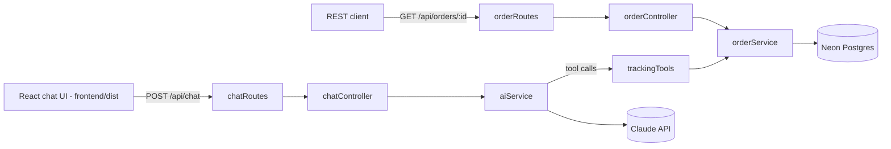

# E-Commerce AI Assistant

Automated order & tracking support assistant. An Express API that lets customers ask natural-language questions about their orders, backed by Claude tool-calling and a Neon (serverless Postgres) database.


## Features

- Natural-language chat endpoint that looks up real order data via Claude tool calling
- Order lookup by order number, customer email, or tracking number
- REST endpoint for direct order lookups (`GET /api/orders/:id`)
- React chat UI (`frontend/`), built with Vite
- Postgres-backed via Neon; schema auto-applies on startup

## Tech Stack

| Layer    | Choice                               |
|----------|---------------------------------------|
| Runtime  | Node.js + Express                     |
| Database | Neon (serverless Postgres) via `pg`   |
| AI       | Claude (Anthropic SDK, tool calling), model `claude-haiku-4-5` |
| Frontend | React 18 + Vite (`frontend/`)         |

## Architecture



## API

| Method | Path              | Description                                                      |
|--------|-------------------|--------------------------------------------------------------------|
| GET    | `/health`         | Liveness check for load balancers / container orchestrators (no auth) |
| GET    | `/api/config`     | Returns the API key for the frontend to use (no auth - see Auth below) |
| POST   | `/api/chat`       | Send a conversation; assistant replies using order-lookup tools (requires `X-API-Key`) |
| GET    | `/api/orders/:id` | Fetch a single order by order number (requires `X-API-Key`)        |

## Setup

```bash
npm install
npm run build       # builds frontend/dist (installs frontend deps first)
cp .env.example .env
# fill in ANTHROPIC_API_KEY, DATABASE_URL (from your Neon project), and API_KEY in .env
npm start
```

For frontend-only iteration, `npm --prefix frontend run dev` runs Vite's dev server on its own port and proxies `/api/*` to a locally running `npm start` on port 3000.

`ANTHROPIC_API_KEY` comes from an Anthropic Console account (console.anthropic.com) - separate from any claude.ai chat subscription, billed per token.

The `orders` table and seed rows are created automatically on startup via `database.sql`. Server runs at `http://localhost:3000`.

### Auth

`/api/chat` and `/api/orders/:id` require an `X-API-Key` header matching `API_KEY` in `.env`:

```bash
curl -H "X-API-Key: $API_KEY" http://localhost:3000/api/orders/ORD-1001
```

This is a single shared secret, not per-customer auth - it blocks anonymous bots from hitting the API directly, but the React app fetches it from `GET /api/config` at runtime (rather than baking it into the build), so anyone who views devtools/network requests can still read it. That runtime-fetch approach also means rotating `API_KEY` server-side doesn't require rebuilding the frontend. Treat this as a minimal deterrent for the current dev/staging phase, not a substitute for real user authentication before handling real customer data.

### Rate limiting

- `/api/chat` is capped at `RATE_LIMIT_MAX` requests (default 20) per `RATE_LIMIT_WINDOW_MS` (default 60s) per client, to bound Claude API cost under abuse or accidental retry loops.
- `/api/orders/:id` is capped at `RATE_LIMIT_ORDERS_MAX` requests (default 30) per `RATE_LIMIT_ORDERS_WINDOW_MS` (default 60s) per client, to slow down order-number enumeration/scanning attempts.

Both are independent limiters (separate quotas). Exceeding either returns `429`.

### Structured logging

Logging runs on [pino](https://getpino.io) (`src/config/logger.js`), emitting structured JSON lines (level, timestamp, message, fields) instead of plain strings - readable by Render's log viewer or any log aggregator. `pino-http` logs every request/response (method, url, status, response time, a generated request id), including ones that never reach a route (404s, auth rejections, rate limits). Level is configurable via `LOG_LEVEL` (default `info`).

`src/utils/logger.js`'s `logError(label, err)` wraps this for caught errors, and the configured `err` serializer only ever includes `type`/`message`/`stack` - never the raw error object. Some HTTP client libraries attach debug properties (request config, headers) directly to thrown errors, and pino's *default* error serializer would include those; ours doesn't, closing a real path for an API key or Authorization header to end up in logs. Client-facing error responses are always a fixed generic message regardless of the underlying failure.

### HTTPS enforcement

When `NODE_ENV=production`, `src/middleware/httpsEnforce.js` redirects any plain-HTTP request to HTTPS (301) and sets `Strict-Transport-Security` on secure responses. `app.set('trust proxy', 1)` is also enabled in production so Express derives `req.secure` (and the real client IP used by rate limiting) from Render's `X-Forwarded-Proto`/`X-Forwarded-For` headers, since Render terminates TLS at its edge and forwards plain HTTP to the container over one hop. This is inactive outside `NODE_ENV=production`, so local dev and tests are unaffected.

## Testing

```bash
npm test
```

Runs the `node:test` suite (`test/`). Database and Claude calls are mocked, so tests don't touch Neon or incur API costs.

## Docker

```bash
docker compose up --build
```

The `Dockerfile` is a multi-stage build: stage one installs `frontend/`'s dependencies and runs `vite build`, stage two installs the backend's production dependencies and copies in the built `frontend/dist`. Runs the resulting image against your `.env` (`docker-compose.yml`). The container exposes a `/health` check.

## Deploy

`render.yaml` defines a free Render web service that builds the existing `Dockerfile` and health-checks `/health`.

1. Push to GitHub (already done if you're reading this from the repo)
2. On [render.com](https://render.com), **New +** → **Blueprint** → connect this repo → Render detects `render.yaml`
3. Fill in the three prompted secrets (`ANTHROPIC_API_KEY`, `DATABASE_URL`, `API_KEY`) - they're marked `sync: false` so Render asks for them rather than storing them in the repo
4. Deploy - Render assigns a public `https://<name>.onrender.com` URL

The free tier spins down after 15 minutes idle, so the first request after inactivity has a cold-start delay (same tradeoff as Neon's compute auto-suspend).

## CI

GitHub Actions (`.github/workflows/ci.yml`) builds `frontend/`, runs the test suite, and builds the Docker image on every push/PR to `main`.

## Project Structure

```
src/
├── config/       # DB connection (pg Pool), Claude client, and pino logger setup
├── services/     # business logic - order queries, AI chat/tool-calling loop
├── tools/        # LLM tool/function definitions and their implementations
├── controllers/  # request/response handling
├── routes/       # Express route definitions
└── app.js        # Express app assembly - serves frontend/dist, exposes GET /api/config
server.js         # process entry point - inits DB schema, then listens
frontend/          # React app (Vite) - separate package.json, own build
├── index.html               # Vite entry HTML
├── vite.config.js
└── src/
    ├── main.jsx              # mounts <App />
    ├── App.jsx                # chat widget - state, submit handling, /api/config fetch
    ├── index.css              # design tokens + component styles
    └── components/
        └── MessageBubble.jsx  # reusable bubble component (user/assistant/pending/error)
frontend/dist/     # build output (gitignored) - what Express actually serves
test/             # node:test suite (mocked DB/Claude, no live calls)
Dockerfile, docker-compose.yml, .dockerignore   # containerization; Dockerfile builds frontend/ in a separate stage
render.yaml       # Render Blueprint for deployment
.env.example      # documents required environment variables
.github/workflows/ci.yml                        # frontend build + test + Docker build on push/PR
```
