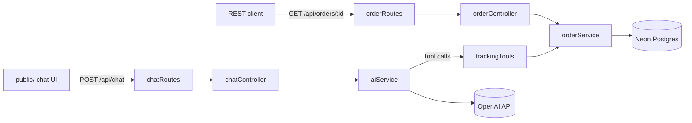

# E-Commerce AI Assistant

Automated order & tracking support assistant. An Express API that lets customers ask natural-language questions about their orders, backed by OpenAI tool-calling and a Neon (serverless Postgres) database.


## Features

- Natural-language chat endpoint that looks up real order data via OpenAI function/tool calling
- Order lookup by order number, customer email, or tracking number
- REST endpoint for direct order lookups (`GET /api/orders/:id`)
- Minimal static chat UI for local testing
- Postgres-backed via Neon; schema auto-applies on startup

## Tech Stack

| Layer    | Choice                               |
|----------|---------------------------------------|
| Runtime  | Node.js + Express                     |
| Database | Neon (serverless Postgres) via `pg`   |
| AI       | OpenAI SDK (tool/function calling)    |
| Frontend | Static HTML/CSS/JS (`public/`)        |

## Architecture



## API

| Method | Path              | Description                                                      |
|--------|-------------------|--------------------------------------------------------------------|
| POST   | `/api/chat`       | Send a conversation; assistant replies using order-lookup tools    |
| GET    | `/api/orders/:id` | Fetch a single order by order number                              |

## Setup

```bash
npm install
# add OPENAI_API_KEY and DATABASE_URL (from your Neon project) to .env
npm start
```

The `orders` table and seed rows are created automatically on startup via `database.sql`. Server runs at `http://localhost:3000`.

## Project Structure

```
src/
├── config/       # DB connection (pg Pool) and OpenAI client setup
├── services/     # business logic - order queries, AI chat/tool-calling loop
├── tools/        # LLM tool/function definitions and their implementations
├── controllers/  # request/response handling
├── routes/       # Express route definitions
└── app.js        # Express app assembly
server.js         # process entry point - inits DB schema, then listens
public/           # static frontend chat UI
```
