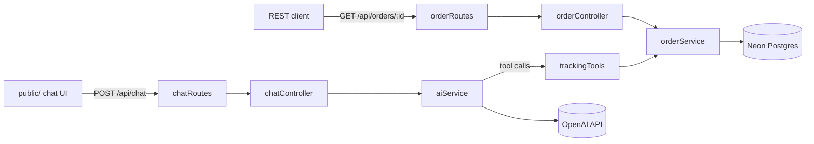

# E-Commerce AI Assistant

Automated order & tracking support assistant. An Express API that lets customers ask natural-language questions about their orders, backed by OpenAI tool-calling and a Neon (serverless Postgres) database.


## Features

- Natural-language chat endpoint that looks up real order data via OpenAI function/tool calling
- Order lookup by order number, customer email, or tracking number
- REST endpoint for direct order lookups (`GET /api/orders/:id`)
- Minimal static chat UI for local testing
- Postgres-backed via Neon; schema auto-applies on startup

## Tech Stack

| Layer    | Choice                               |
|----------|---------------------------------------|
| Runtime  | Node.js + Express                     |
| Database | Neon (serverless Postgres) via `pg`   |
| AI       | OpenAI SDK (tool/function calling)    |
| Frontend | Static HTML/CSS/JS (`public/`)        |

## Architecture



## API

| Method | Path              | Description                                                      |
|--------|-------------------|--------------------------------------------------------------------|
| GET    | `/health`         | Liveness check for load balancers / container orchestrators (no auth) |
| POST   | `/api/chat`       | Send a conversation; assistant replies using order-lookup tools (requires `X-API-Key`) |
| GET    | `/api/orders/:id` | Fetch a single order by order number (requires `X-API-Key`)        |

## Setup

```bash
npm install
cp .env.example .env
# fill in OPENAI_API_KEY, DATABASE_URL (from your Neon project), and API_KEY in .env
npm start
```

The `orders` table and seed rows are created automatically on startup via `database.sql`. Server runs at `http://localhost:3000`.

### Auth

`/api/chat` and `/api/orders/:id` require an `X-API-Key` header matching `API_KEY` in `.env`:

```bash
curl -H "X-API-Key: $API_KEY" http://localhost:3000/api/orders/ORD-1001
```

This is a single shared secret, not per-customer auth - it blocks anonymous bots from hitting the API directly, but the chat UI serves it to the browser (`GET /app.js` injects `API_KEY` into the response at request time, so anyone who views the page source can still read it - it's just no longer hardcoded into tracked source, so it doesn't end up committed to git). Treat this as a minimal deterrent for the current dev/staging phase, not a substitute for real user authentication before handling real customer data.

### Rate limiting

`/api/chat` is capped at `RATE_LIMIT_MAX` requests (default 20) per `RATE_LIMIT_WINDOW_MS` (default 60s) per client, to bound OpenAI API cost under abuse or accidental retry loops. Exceeding it returns `429`.

## Testing

```bash
npm test
```

Runs the `node:test` suite (`test/`). Database and OpenAI calls are mocked, so tests don't touch Neon or incur API costs.

## Docker

```bash
docker compose up --build
```

Builds the app image and runs it against your `.env` (`docker-compose.yml`). The container exposes a `/health` check.

## Deploy

`render.yaml` defines a free Render web service that builds the existing `Dockerfile` and health-checks `/health`.

1. Push to GitHub (already done if you're reading this from the repo)
2. On [render.com](https://render.com), **New +** → **Blueprint** → connect this repo → Render detects `render.yaml`
3. Fill in the three prompted secrets (`OPENAI_API_KEY`, `DATABASE_URL`, `API_KEY`) - they're marked `sync: false` so Render asks for them rather than storing them in the repo
4. Deploy - Render assigns a public `https://<name>.onrender.com` URL

The free tier spins down after 15 minutes idle, so the first request after inactivity has a cold-start delay (same tradeoff as Neon's compute auto-suspend).

## CI

GitHub Actions (`.github/workflows/ci.yml`) runs the test suite and builds the Docker image on every push/PR to `main`.

## Project Structure

```
src/
├── config/       # DB connection (pg Pool) and OpenAI client setup
├── services/     # business logic - order queries, AI chat/tool-calling loop
├── tools/        # LLM tool/function definitions and their implementations
├── controllers/  # request/response handling
├── routes/       # Express route definitions
└── app.js        # Express app assembly
server.js         # process entry point - inits DB schema, then listens
public/           # static frontend chat UI
test/             # node:test suite (mocked DB/OpenAI, no live calls)
Dockerfile, docker-compose.yml, .dockerignore   # containerization
render.yaml       # Render Blueprint for deployment
.env.example      # documents required environment variables
.github/workflows/ci.yml                        # test + Docker build on push/PR
```
